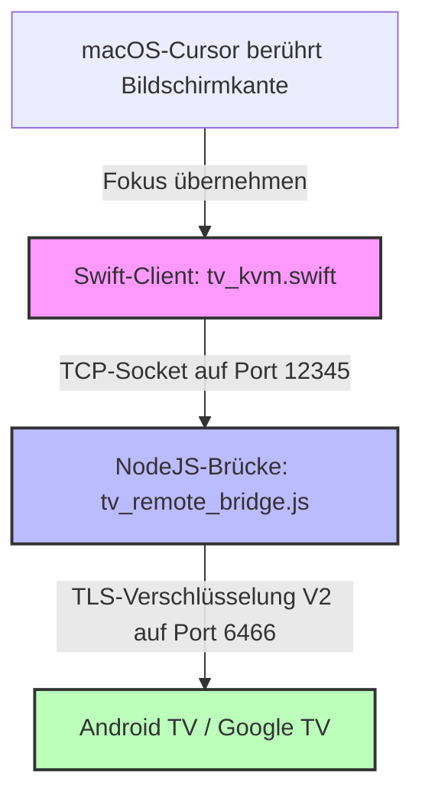

# Pano — macOS zu Android TV Kabellose KVM-Brücke

🌐 **[English](README.md) | [Русский](README.ru.md) | [Deutsch](README.de.md) | [Français](README.fr.md) | [Italiano](README.it.md) | [Español](README.es.md) | [中文](README.zh.md)**

<p align="center">
  
</p>

<p align="center">
  
  
  
  
  
</p>

---

**Pano** ist eine erstklassige, ultraleichte macOS-Menüleistenanwendung und Node.js-Loopback-Backend-Brücke, die das Trackpad und die Tastatur Ihres Macs in einen nahtlosen, kabellosen KVM-Switch für Ihr Google TV- oder Android TV-Gerät verwandelt.

Im Gegensatz zu einfachen Fernbedienungs-Apps repliziert Pano eine **native Hardware-KVM-Erfahrung** über Ihr lokales Netzwerk unter Verwendung des offiziellen verschlüsselten TLS-Protokolls Google TV Remote V2. Es bietet extrem flüssiges Scrollen, reaktionsschnelle Trackpad-Gestensteuerung, sofortige Systemlautstärkeregelung und ein voll funktionsfähiges Hardware-Tastaturlayout bei absolut null CPU-Auslastung.

---

## ⚡ Hauptmerkmale

### ⌨️ 1. Hardware-Tastaturemulation (EN/RU)
* **Low-Level-Scan-Codes**: Verwendet direkte Android-Scan-Code-Emulation (z. B. `KEYCODE_A`, `KEYCODE_SPACE`) für maximale Geschwindigkeit und null Eingabeverzögerung.
* **Zweisprachige Unterstützung**: Volle native Unterstützung für englische und russische Tastaturlayouts (einschließlich Groß-/Kleinschreibung, Satzzeichen und Sonderzeichen).
* **100% App-Kompatibilität**: Die direkte Eingabe umgeht die fragilen Grenzen der IME-Textsynchronisation und funktioniert in jeder App (YouTube, Netflix, Webbrowsern, Yandex, Kinopoisk) fehlerfrei.
* **Intelligenter Fallback**: Automatischer Wechsel zum Base64-codierten nativen IME-Protokoll für seltene Sonderzeichen und andere Sprachen.

### 🖱️ 2. Intelligente Trackpad-Gestensteuerung
* **Präzise Gitternavigation**: Übersetzt Mausbewegungen und Ein-Finger-Trackpad-Wischgesten automatisch in präzise D-Pad-Richtungsklicks, die perfekt auf das Kachellayout des Smart TVs abgestimmt sind.
* **Lautstärkeregelung per Scrollen**: Unterstützt das bequeme Scrollen mit zwei Fingern auf dem Trackpad, um die TV-Lautstärke (Lauter / Leiser) mit einer benutzerdefinierten, ultraschnellen 60-ms-Wiederholungsverzögerung zu ändern.
* **Schutz vor versehentlichem Wischen**: Während Sie mit zwei Fingern scrollen (die Lautstärke anpassen), blockiert Pano vorübergehend die vertikale D-Pad-Navigation für 300 ms, um ein versehentliches Springen in Listen auf Ihrem Fernseher zu verhindern.
* **Cursor-Sperre & Schutz**: Wenn aktiv, fängt Pano Ihren Mauszeiger ab und sperrt ihn an der gewählten Bildschirmkante, sodass er nicht versehentlich in Ihren macOS-Arbeitsbereich zurückkehren kann, bis Sie den Modus explizit beenden.

### 🖥️ 3. Nahtloser Wechsel der Bildschirmkanten
* **Klickfreie Aktivierung**: Bewegen Sie Ihren Mauszeiger an die gewählte Kante Ihres Macs (Rechts, Links oder Oben) und halten Sie ihn dort für 800 ms. Pano übernimmt sofort den Fokus und übergibt die Kontrolle an Ihren Fernseher. Die 800-ms-Verzögerung dient als Schutz vor versehentlichen Auslösungen bei der täglichen Mac-Arbeit.
* **Native Fokuserhöhung**: Die native Swift-Anwendung hebt ihr Fenster vorübergehend auf die Ebene `.statusBar` an und aktualisiert die macOS-Aktivierungsrichtlinie, um den Fokus sicher zu übernehmen, und gibt ihn beim Verlassen sauber wieder frei.

### 🔌 4. Keine CPU-Auslastung & Auto-Reconnect
* **Extrem optimiert**: Verfügt über eine hochgradig optimierte Heartbeat-Prüfung, die alle 2 Sekunden mit `0 % CPU`-Auslastung läuft.
* **Robuster Verbindungszyklus**: Behebt Socket-Hänger in der zugrunde liegenden Bibliothek `androidtv-remote`. Die Verbindung wird bei Fehlern oder Verbindungsabbrüchen garantiert sauber geschlossen und neu gestartet.
* **Automatische Wiederherstellung**: Integriert ein 5-Sekunden-TLS-Timeout. Wenn der Fernseher ausgeschaltet wird oder das Netzwerk verlässt, trennt sich Pano sauber und versucht im Hintergrund automatisch eine erneute Verbindung, sobald das Gerät wieder erreichbar ist.

### 🟢 5. macOS Menüleisten-Interface
* **Sichere Speicherung**: Speichert TLS-Zertifikate und Kopplungsschlüssel nach dem ersten Mal sicher ab, sodass keine erneute PIN-Eingabe erforderlich ist.
* **Sofortiger Schnellstart**: Verbindet sich beim Starten der Anwendung automatisch mit dem Fernseher.
* **Nativer Status-Indikator**: Ein elegantes, monochromes Monitor-Symbol integriert sich nahtlos in das macOS-Systemthema und zeigt den Verbindungsstatus durch Deckkraft und Animation an:
  * **Verbunden**: Vollständig deckendes Monitor-Symbol mit Bildschirmfüllung.
  * **Verbinden / Koppeln**: Blinkendes Monitor-Symbol.
  * **Getrennt / Unerreichbar**: Teilweise transparentes Monitor-Symbol (35 % Deckkraft).

---

## 🏗️ Projektarchitektur



* **`tv_kvm.swift`**: Eine native Swift-Cocoa-Anwendung, die direkt in der macOS-Menüleiste läuft. Sie überwacht Bildschirmkantenübergänge, stellt ein transparentes Touch-Overlay bereit, verarbeitet Gesten und sendet Befehle an den Loopback-Socket.
* **`tv_remote_bridge.js`**: Ein leichtgewichtiger Node.js-Helfer, der als lokaler Loopback-Server fungiert. Er übersetzt die Klartextbefehle von Swift in verschlüsselte Google TV Protobuf V2-Nachrichten und verwaltet die TLS-Kopplung.
* **`lib_patches/`**: Vorkonfigurierte Patches, die die optimale Leistung der zugrunde liegenden Node-Bibliothek sicherstellen, Socket-Leaks beheben und eine umfassende IME-Texteingabeunterstützung hinzufügen.

---

## 🛠️ Installation & Setup

Wählen Sie die Installationsmethode, die am besten zu Ihnen passt:

### Option 1: Schnelle Installation über Homebrew Cask (Empfohlen)
Wenn Sie Homebrew verwenden, können Sie Pano mit einem einzigen Terminal-Befehl installieren:
```bash
brew install --cask ponano/pano/pano
```
Dadurch wird das Repository automatisch hinzugefügt, die neueste Version heruntergeladen und `Pano.app` in Ihrem Programme-Ordner installiert.

### Option 2: Manuelle Installation über das DMG-Image
Wenn Sie eine Standard-macOS-Installation bevorzugen:
1. Öffnen Sie die [Pano Releases](https://github.com/ponano/androidtvremotemacos/releases)-Seite auf GitHub.
2. Laden Sie die neueste `Pano.dmg`-Datei herunter.
3. Öffnen Sie die heruntergeladene `.dmg`-Datei und ziehen Sie das **Pano**-Symbol in Ihren **Programme**-Ordner (Applications).

### Option 3: Entwickler- / Quellcode-Installation
Wenn Sie Pano aus dem Quellcode erstellen und ausführen möchten:
1. **Voraussetzungen**: Stellen Sie sicher, dass Sie **macOS 12.0+**, **Node.js (v16+)** und den **Swift-Compiler** installiert haben (wird automatisch mit den Xcode Command Line Tools installiert).
2. **Klonen oder laden** Sie dieses Repository herunter.
3. **IP konfigurieren**: Öffnen Sie die Datei `run_kvm.sh` in einem Texteditor und tragen Sie die IP-Adresse Ihres Fernsehers ein:
   ```bash
   TV_IP="192.168.1.100"  # Ersetzen Sie dies durch die IP Ihres TVs
   ```
4. **Ausführen**: Starten Sie die KVM-Brücke über das Terminal:
   ```bash
   bash run_kvm.sh
   ```

---

### 🔑 Sichere Kopplung (Nur beim ersten Start)
Beim ersten Start von Pano (unabhängig von der gewählten Methode):
1. Auf Ihrem Mac-Bildschirm erscheint ein sicheres Popup, das nach einem 6-stelligen PIN-Code fragt.
2. Geben Sie den 6-stelligen PIN-Code ein, der auf Ihrem Android TV- / Google TV-Bildschirm angezeigt wird.
3. Nach Abschluss werden Ihre TLS-Zertifikate sicher unter `~/.tv_kvm_credentials/` (oder `~/.credentials/` im Testmodus) gespeichert, und Sie müssen die Geräte nicht erneut koppeln.
4. **Loslegen**: Bewegen Sie den Cursor an die ausgewählte Kante des Mac-Bildschirms, halten Sie ihn kurz an (800 ms) und steuern Sie den Fernseher!

---

## 🔑 Tastatur- und Gestenzuordnungen

Wenn Pano aktiv ist, werden Ihre Tastatureingaben wie folgt an den Fernseher übertragen:

| Mac-Tastatureingabe | Android TV Befehl |
| :--- | :--- |
| **`Pfeiltasten` (Auf/Ab/Links/Rechts)** | Navigation (D-pad Auf/Ab/Links/Rechts) |
| **`Eingabe` / `Enter`** | Bestätigen / OK (D-pad Center) |
| **`Rücktaste` / `Entf` / `Esc`** | Zurück-Taste |
| **`Cmd` + `Rücktaste`** oder **`Cmd` + `Esc`** | Startbildschirm (Home Screen) |
| **`Leertaste`** | Medien abspielen / pausieren |
| **`F11` / `F12`** (oder **Lautstärketasten**) | TV Lautstärke leiser / lauter |
| **`F10`** (oder **Stummschalttaste**) | TV stummschalten |
| **`Tab`** | Nächstes fokussierbares Element |
| **`Doppel-Shift`** oder **`Strg` + `Leertaste`** | Eingabelayout wechseln (EN ⇄ RU) |
| **Beliebiges Zeichen (A-Z, 0-9, Symbole)** | Direkte Texteingabe in ein beliebiges Eingabefeld |

### Trackpad-Gesten & Aktionen
* **Ein-Finger-Wischen (Auf / Ab / Links / Rechts)**: Wird in Standard-D-Pad-Richtungsklicks zum Navigieren in Rastern und Menüs übersetzt.
* **Scrollen mit zwei Fingern (Auf / Ab)**: Steuert die TV-Lautstärke (Lauter / Leiser).

---

## 🛡️ macOS Bedienungshilfen-Berechtigung (Accessibility)

Da Pano Ihren Mauszeiger am Bildschirmrand verfolgt und Tastatur-Scan-Codes im aktiven Zustand umleitet, **verlangt macOS, dass Sie dem Terminal oder der kompilierten App Berechtigungen für Bedienungshilfen erteilen**.

### So autorisieren Sie die App:
1. Wenn Sie `run_kvm.sh` zum ersten Mal ausführen, zeigt macOS einen Systemdialog mit dem Text: *"Terminal (oder tv_kvm) möchte diesen Computer mithilfe von Bedienungshilfen steuern"*.
2. Klicken Sie auf **Systemeinstellungen öffnen**.
3. Navigieren Sie zu **Datenschutz & Sicherheit** ➔ **Bedienungshilfen**.
4. Suchen Sie **Terminal** (oder **tv_kvm**) in der Liste und aktivieren Sie den Schalter (🟢).
5. Starten Sie das Skript `run_kvm.sh` im Terminal neu.

---

## 📄 Lizenz

Dieses Projekt ist Open-Source und steht unter der [MIT-Lizenz](LICENSE).
