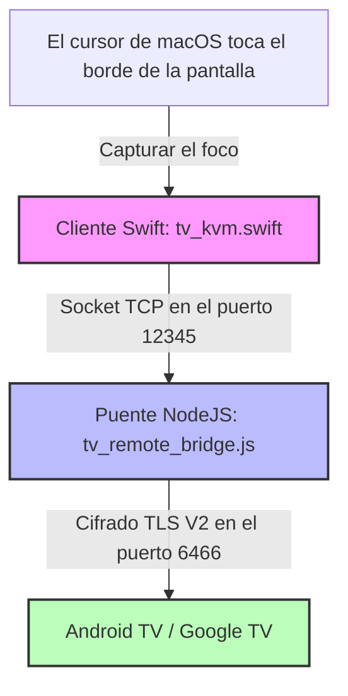

# Pano — Puente KVM inalámbrico de macOS a Android TV

🌐 **[English](README.md) | [Русский](README.ru.md) | [Deutsch](README.de.md) | [Français](README.fr.md) | [Italiano](README.it.md) | [Español](README.es.md) | [中文](README.zh.md)**

<p align="center">
  
</p>

<p align="center">
  
  
  
  
  
</p>

---

**Pano** es una aplicación premium y ultraligera para la barra de menús de macOS, combinada con un puente de bucle local backend Node.js. Juntos, transforman el trackpad y el teclado de su Mac en un conmutador KVM inalámbrico y fluido para su dispositivo Google TV o Android TV.

A diferencia de las aplicaciones de control remoto móvil tradicionales, Pano reproduce una **experiencia KVM de hardware nativa** en su red local utilizando el protocolo TLS cifrado oficial Google TV Remote V2. Ofrece un desplazamiento increíblemente fluido, una navegación receptiva con gestos en el trackpad, control instantáneo del volumen del sistema de la TV y un teclado de hardware completamente funcional con carga de CPU cero.

---

## ⚡ Características clave

### ⌨️ 1. Emulación de teclado de hardware (EN/RU)
* **Códigos de escaneo de bajo nivel**: Utiliza la emulación directa de códigos de escaneo de Android (por ejemplo, `KEYCODE_A`, `KEYCODE_SPACE`) para obtener la máxima velocidad de respuesta y cero retraso de entrada.
* **Soporte bilingüe nativo**: Soporte completo para distribuciones de teclado en inglés y ruso (incluyendo mayúsculas, minúsculas, puntuación y símbolos).
* **Compatibilidad 100% con aplicaciones**: La inyección directa elude los frágiles límites de sincronización de texto de los IME (editores de métodos de entrada), funcionando perfectamente en todas las aplicaciones (YouTube, Netflix, navegadores, Yandex, Kinopoisk).
* **Fallback inteligente**: Cambio automático al protocolo IME nativo codificado en Base64 para caracteres especiales raros y otros idiomas.

### 🖱️ 2. Gestión inteligente de trackpad y gestes
* **Navegación de cuadrícula discreta**: Traduce automáticamente los movimientos del ratón y los desplazamientos del trackpad con un solo dedo en clics direccionales D-pad precisos, que se adaptan perfectamente a la interfaz de mosaico de la Smart TV.
* **Control de volumen mediante desplazamiento**: Admite el cómodo desplazamiento del trackpad con dos dedos para modificar el volumen de la TV (Más alto / Más bajo) con un retraso de repetición personalizado y ultra-rápido de 60 ms.
* **Protección contra desplazamientos accidentales**: Durante el desplazamiento con dos dedos (regulación del volumen), Pano bloquea temporalmente la navegación vertical D-pad durante 300 ms, impidiendo saltos accidentales de listas en la TV.
* **Bloqueo del cursor**: Cuando está activo, Pano captura y bloquea el cursor del ratón en el borde de la pantalla elegido, impidiendo que vuelva accidentalmente a su espacio de trabajo de macOS hasta que salga explícitamente del modo.

### 🖥️ 3. Transición fluida a través de los bordes de la pantalla
* **Activación sin clics**: Mueva el cursor del ratón hacia el borde elegido de su Mac (Derecha, Izquierda o Arriba) y manténgalo allí durante 800 ms. Pano capturará instantáneamente el foco y entregará el control a su TV. El retraso de 800 ms sirve como filtro de seguridad contra activaciones accidentales durante el trabajo diario en Mac.
* **Elevación de foco nativa**: La aplicación Swift nativa eleva temporalmente el nivel de su ventana a `.statusBar` y actualiza la política de activación de macOS para capturar el foco de forma segura, y luego lo libera limpiamente al salir.

### 🔌 4. Carga de CPU nula y reconexión automática
* **Extremadamente optimizado**: Cuenta con un proceso de comprobación del estado (heartbeat) altamente optimizado que se ejecuta cada 2 segundos con una carga de CPU del `0%`.
* **Ciclo de conexión robusto**: Resuelve los bloqueos de sockets de la biblioteca subyacente `androidtv-remote`. Se garantiza que la conexión se cierre y se reinicie correctamente en caso de errores o desconexiones.
* **Recuperación automática**: Integra un tiempo de espera TLS de 5 segundos. Si la TV se apaga o abandona la red, Pano se desconecta limpiamente e intenta la recuperación en segundo plano tan pronto como el dispositivo vuelva a estar accesible.

### 🟢 5. Interfaz de la barra de menús de macOS
* **Almacenamiento seguro**: Guarda de forma segura los certificados TLS y las claves de vinculación después de la primera vez, de modo que no se requiera volver a introducir el PIN.
* **Inicio instantáneo**: Se conecta automáticamente a la TV al iniciar la aplicación.
* **Indicador de estado nativo**: Un elegante icono de monitor monocromático que se integra perfectamente con el tema del sistema macOS, indicando el estado de la conexión mediante la opacidad y la animación:
  * **Conectado**: Icono del monitor completamente opaco con relleno de la pantalla.
  * **Conectando / Vinculando**: Icono del monitor parpadeante.
  * **Desconectado / Inaccesible**: Icono del monitor parcialmente transparente (35% de opacidad).

---

## 🏗️ Arquitectura del proyecto



* **`tv_kvm.swift`**: Una aplicación Swift Cocoa nativa que se ejecuta directamente en la barra de menús de macOS. Supervisa las transiciones por los bordes de la pantalla, proporciona una superposición táctil transparente, gestiona los gestos y envía comandos al socket de bucle local.
* **`tv_remote_bridge.js`**: Un ligero asistente de Node.js que actúa como un servidor de bucle local local. Traduce los comandos en texto claro de Swift en mensajes Google TV Protobuf V2 cifrados y gestiona la vinculación TLS.
* **`lib_patches/`**: Parches preconfigurados que garantizan el rendimiento óptimo de la biblioteca Node subyacente, resolviendo pérdidas de sockets y añadiendo un soporte completo para la introducción de texto mediante IME.

---

## 🛠️ Instalación y Configuración

Elija el método de instalación que mejor se adapte a sus necesidades:

### Opción 1: Instalación rápida a través de Homebrew Cask (Recomendado)
Si utiliza Homebrew, puede instalar Pano con un solo comando en la terminal:
```bash
brew install --cask ponano/pano/pano
```
Esto conectará automáticamente el repositorio, descargará la última versión e instalará `Pano.app` directamente en su carpeta de Aplicaciones.

### Opción 2: Instalación manual a través de la imagen de disco DMG
Si prefiere un instalador gráfico estándar para macOS:
1. Abra la página de [Lanzamientos de Pano (Releases)](https://github.com/ponano/androidtvremotemacos/releases) en GitHub.
2. Descargue el archivo `Pano.dmg` más reciente.
3. Abra el archivo `.dmg` descargado y arrastre el icono de **Pano** a su carpeta de **Aplicaciones** (Applications).

### Opción 3: Instalación desde el código fuente (Para desarrolladores)
Si desea compilar y ejecutar Pano manualmente:
1. **Requisitos previos**: Asegúrese de tener **macOS 12.0+**, **Node.js (v16+)** y el **compilador Swift** instalado (incluido en las herramientas de línea de comandos de Xcode).
2. **Clone o descargue** este repositorio.
3. **Configure la IP**: Abra el archivo `run_kvm.sh` in un editor de texto e introduzca la dirección IP local de su TV:
   ```bash
   TV_IP="192.168.1.100"  # Reemplace con la IP de su TV
   ```
4. **Ejecutar**: Inicie el puente KVM a través de la Terminal:
   ```bash
   bash run_kvm.sh
   ```

---

### 🔑 Vinculación Segura (Solo en el primer inicio)
En el primer inicio de Pano (independientemente del método elegido):
1. Aparecerá una ventana emergente segura en la pantalla de su Mac solicitando un PIN de 6 dígitos.
2. Introduzca el PIN de 6 dígitos que se muestra en la pantalla de su Android TV / Google TV.
3. Una vez completado, sus certificados TLS se guardarán de forma segura en `~/.tv_kvm_credentials/` (o `~/.credentials/` en modo de prueba) y no será necesario repetir la vinculación.
4. **Comience a controlar**: Mueva el cursor hacia el borde elegido de la pantalla del Mac, manténgalo allí un instante (800 ms) y comience a controlar la TV.

---

## 🔑 Mapeo de teclas y gestos

Cuando Pano está activo, sus entradas de teclado se transmiten a la TV de la siguiente manera:

| Tecla Mac | Comando Android TV |
| :--- | :--- |
| **`Teclas de flecha` (Arriba/Abajo/Izquierda/Derecha)** | Navegación (D-pad Arriba/Abajo/Izquierda/Derecha) |
| **`Intro` / `Enter`** | Confirmar / OK (D-pad Center) |
| **`Retroceso` / `Supr` / `Esc`** | Botón Atrás |
| **`Cmd` + `Retroceso`** o **`Cmd` + `Esc`** | Pantalla de inicio (Home Screen) |
| **`Espacio`** | Reproducir / Pausar medios |
| **`F11` / `F12`** (o **Teclas de volumen**) | Disminuir / Aumentar el volumen de la TV |
| **`F10`** (o **Tecla Mute**) | Silenciar el sonido de la TV |
| **`Tab`** | Siguiente elemento seleccionable |
| **`Doble Shift`** o **`Ctrl` + `Espacio`** | Cambiar el idioma de entrada (EN ⇄ RU) |
| **Cualquier carácter (A-Z, 0-9, Símbolos)** | Introducción directa de texto en cualquier campo de entrada |

### Gestos & Acciones del Trackpad
* **Desplazamiento con un dedo (Arriba / Abajo / Izquierda / Derecha)**: Se traduce en clics direccionales D-pad estándar para navegar por cuadrículas y menús.
* **Desplazamiento con dos dedos (Arriba / Abajo)**: Controla el volumen de la TV (Más alto / Más bajo).

---

## 🛡️ Permiso de Accesibilidad de macOS (Accessibility)

Dado que Pano rastrea el cursor del ratón en el borde de la pantalla y redirige los códigos de escaneo del teclado cuando está activo, **macOS requiere que conceda permisos de Accesibilidad a la terminal o a la aplicación compilada**.

### Cómo autorizar la aplicación:
1. Cuando inicie `run_kvm.sh` por primera vez, macOS mostrará un cuadro de diálogo del sistema que indica: *"Terminal (o tv_kvm) desea controlar este ordenador utilizando las funciones de accesibilidad"*.
2. Haga clic en **Abrir Ajustes del sistema**.
3. Vaya a **Privacidad y seguridad** ➔ **Accesibilidad**.
4. Busque **Terminal** (o **tv_kvm**) en la lista y active el interruptor (🟢).
5. Reinicie el script `run_kvm.sh` en la terminal.

---

## 📄 Licencia

Este proyecto es de código abierto y está distribuido bajo la [Licencia MIT](LICENSE).
