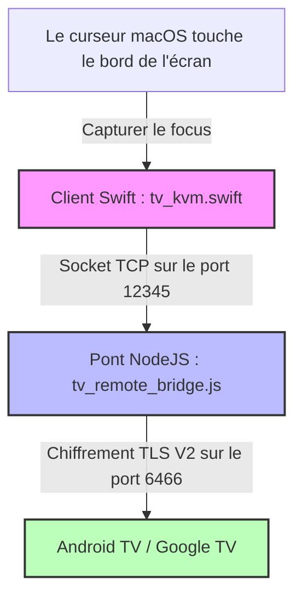

# Pano — Pont KVM sans fil macOS vers Android TV

🌐 **[English](README.md) | [Русский](README.ru.md) | [Deutsch](README.de.md) | [Français](README.fr.md) | [Italiano](README.it.md) | [Español](README.es.md) | [中文](README.zh.md)**

<p align="center">
  
</p>

<p align="center">
  
  
  
  
  
</p>

---

**Pano** est une application haut de gamme et ultra-légère pour la barre de menus de macOS, associée à un pont d'arrière-plan en boucle locale Node.js. Ensemble, ils transforment le trackpad et le clavier de votre Mac en un commutateur KVM sans fil et fluide pour votre appareil Google TV ou Android TV.

Contrairement aux applications de télécommande mobile classiques, Pano reproduit une **expérience KVM matérielle native** sur votre réseau local en utilisant le protocole TLS chiffré officiel Google TV Remote V2. Il offre un défilement ultra-fluide, une navigation réactive par gestes sur le trackpad, un contrôle instantané du volume du système de la TV et une prise en charge complète du clavier matériel, le tout avec une charge CPU de 0%.

---

## ⚡ Caractéristiques clés

### ⌨️ 1. Émulation matérielle du clavier (EN/RU)
* **Codes de balayage bas niveau** : Utilise l'émulation directe de codes de balayage Android (ex. `KEYCODE_A`, `KEYCODE_SPACE`) pour une vitesse maximale et aucun décalage d'entrée.
* **Prise en charge bilingue** : Support natif complet pour les dispositions de clavier anglaises et russes (y compris majuscules, minuscules, ponctuation et symboles).
* **Compatibilité 100% avec les applications** : L'injection directe contourne les limites fragiles de la synchronisation de texte des IME (éditeurs de méthode d'entrée), fonctionnant parfaitement dans toutes les applications (YouTube, Netflix, navigateurs, Yandex, Kinopoisk).
* **Repli intelligent (Fallback)** : Passage automatique au protocole IME natif encodé en Base64 pour les caractères spéciaux rares et les autres langues.

### 🖱️ 2. Gestion intelligente du trackpad et des gestes
* **Navigation par grille discrète** : Traduit automatiquement les mouvements de la souris et les balayages à un seul doigt sur le trackpad en clics directionnels D-pad précis, parfaitement adaptés à l'interface de la Smart TV.
* **Contrôle du volume par défilement** : Prend en charge le défilement pratique à deux doigts sur le trackpad pour modifier le volume du téléviseur (Plus fort / Moins fort) avec un délai de répétition personnalisé et ultra-rapide de 60 ms.
* **Protection contre les balayages accidentels** : Pendant que vous défilez à deux doigts (réglage du volume), Pano bloque temporairement la navigation verticale D-pad pendant 300 ms, empêchant ainsi les sauts de liste accidentels sur votre téléviseur.
* **Verrouillage du curseur** : Lorsqu'il est actif, Pano capture et verrouille votre curseur sur le bord de l'écran choisi, l'empêchant de revenir accidentellement vers votre espace de travail macOS jusqu'à ce que vous quittiez explicitement le mode.

### 🖥️ 3. Transition fluide par les bords de l'écran
* **Activation sans clic** : Déplacez le curseur de votre souris vers le bord choisi de votre Mac (Droite, Gauche ou Haut) et maintenez-le pendant 800 ms. Pano prendra instantanément le focus et donnera le contrôle à votre téléviseur. Le délai de 800 ms sert de filtre de sécurité contre les déclenchements accidentels lors du travail quotidien sur Mac.
* **Élévation de focus native** : L'application Swift native élève temporairement le niveau de sa fenêtre à `.statusBar` et met à jour la politique d'activation de macOS pour capturer le focus de manière sécurisée, puis le relâche proprement lorsque vous quittez.

### 🔌 4. Charge CPU nulle et reconnexion automatique
* **Extrêmement optimisé** : Dispose d'un processus de vérification de l'état (heartbeat) hautement optimisé qui s'exécute toutes les 2 secondes avec une charge CPU de `0%`.
* **Cycle de connexion robuste** : Résout les blocages de socket de la bibliothèque sous-jacente `androidtv-remote`. La connexion est garantie d'être correctement fermée et redémarrée en cas d'erreur ou de déconnexion.
* **Récupération automatique** : Intègre un délai d'expiration TLS de 5 secondes. Si le téléviseur est éteint ou quitte le réseau, Pano se déconnecte proprement et tente de se reconnecter en arrière-plan dès que l'appareil est à nouveau accessible.

### 🟢 5. Interface de barre de menus macOS
* **Stockage sécurisé** : Enregistre en toute sécurité les certificats TLS et les clés d'association après la première fois, de sorte qu'aucune nouvelle saisie de code PIN n'est requise.
* **Démarrage instantané** : Se connecte automatiquement au téléviseur lors du lancement de l'application.
* **Indicateur de statut natif** : Une icône de moniteur élégante et monochrome qui s'intègre parfaitement au thème système de macOS, indiquant l'état de la connexion par l'opacité et l'animation :
  * **Connecté** : Icône de moniteur entièrement opaque avec remplissage de l'écran.
  * **Connexion / Association** : Icône de moniteur clignotante.
  * **Déconnecté / Inaccessible** : Icône de moniteur semi-transparente (opacité de 35%).

---

## 🏗️ Architecture du projet



* **`tv_kvm.swift`** : Une application Swift Cocoa native s'exécutant directement dans la barre de menus de macOS. Elle surveille les transitions par les bords de l'écran, fournit une superposition tactile transparente, gère les gestes et envoie des commandes au socket en boucle locale.
* **`tv_remote_bridge.js`** : Un assistant Node.js léger qui agit comme un serveur de boucle locale local. Il traduit les commandes en texte clair de Swift en messages Google TV Protobuf V2 chiffrés et gère l'association TLS.
* **`lib_patches/`** : Correctifs préconfigurés assurant les performances optimales de la bibliothèque Node sous-jacente, résolvant les fuites de socket et ajoutant une prise en charge complète de la saisie de texte via l'IME.

---

## 🛠️ Installation & Configuration

Choisissez la méthode d'installation qui vous convient le mieux :

### Option 1 : Installation rapide via Homebrew Cask (Recommandé)
Si vous utilisez Homebrew, vous pouvez installer Pano avec une seule commande dans votre terminal :
```bash
brew install --cask ponano/pano/pano
```
Cette commande connecte automatiquement le dépôt, télécharge la dernière version et installe `Pano.app` directement dans votre dossier Applications.

### Option 2 : Installation manuelle via l'image disque DMG
Si vous préférez un installateur graphique standard pour macOS :
1. Ouvrez la page des [Versions de Pano (Releases)](https://github.com/ponano/androidtvremotemacos/releases) sur GitHub.
2. Téléchargez le dernier fichier `Pano.dmg`.
3. Ouvrez le fichier `.dmg` téléchargé et glissez l'icône **Pano** dans votre dossier **Applications**.

### Option 3 : Installation à partir du code source (Pour les développeurs)
Si vous souhaitez compiler et exécuter Pano manuellement :
1. **Prérequis** : Assurez-vous d'avoir **macOS 12.0+**, **Node.js (v16+)** et le **compilateur Swift** installé (inclus dans les outils de ligne de commande Xcode).
2. **Clonez ou téléchargez** ce dépôt.
3. **Configurer l'IP** : Ouvrez le fichier `run_kvm.sh` dans un éditeur de texte et spécifiez l'adresse IP locale de votre téléviseur :
   ```bash
   TV_IP="192.168.1.100"  # Remplacez par l'IP de votre téléviseur
   ```
4. **Exécuter** : Lancez le pont KVM via le Terminal :
   ```bash
   bash run_kvm.sh
   ```

---

### 🔑 Association sécurisée (Premier démarrage uniquement)
Lors du premier démarrage de Pano (quelle que soit la méthode choisie) :
1. Un popup sécurisé apparaîtra sur l'écran de votre Mac demandant un code PIN à 6 chiffres.
2. Saisissez le code PIN à 6 chiffres affiché sur l'écran de votre Android TV / Google TV.
3. Une fois terminé, vos certificats TLS seront enregistrés en toute sécurité dans `~/.tv_kvm_credentials/` (ou `~/.credentials/` en mode test) et vous n'aurez plus besoin de refaire l'association.
4. **Commencer à contrôler** : Déplacez votre curseur vers le bord sélectionné de l'écran de votre Mac, maintenez-le brièvement (800 ms) et commencez à naviguer sur votre téléviseur !

---

## 🔑 Mappages de touches et de gestes

Lorsque Pano est actif, vos saisies au clavier sont transmises au téléviseur comme suit :

| Touche Mac | Commande Android TV |
| :--- | :--- |
| **`Touches fléchées` (Haut/Bas/Gauche/Droite)** | Navigation (D-pad Haut/Bas/Gauche/Droite) |
| **`Entrée` / `Return`** | Confirmer / OK (D-pad Center) |
| **`Retour arrière` / `Suppr` / `Échap`** | Bouton Retour |
| **`Cmd` + `Retour arrière`** ou **`Cmd` + `Échap`** | Écran d'accueil (Home Screen) |
| **`Espace`** | Lecture / Pause des médias |
| **`F11` / `F12`** (ou **Touches de volume**) | Diminuer / Augmenter le volume de la TV |
| **`F10`** (ou **Touche Mute**) | Couper le son de la TV |
| **`Tab`** | Élément sélectionnable suivant |
| **`Double-Maj`** ou **`Ctrl` + `Espace`** | Changer la langue de saisie (EN ⇄ RU) |
| **N'importe quel caractère (A-Z, 0-9, Symboles)** | Saisie de texte directe dans n'importe quel champ de saisie |

### Gestes & Actions du Trackpad
* **Balayage à un doigt (Haut / Bas / Gauche / Droite)** : Se traduit en clics directionnels D-pad standard pour naviguer dans les grilles et les menus.
* **Défilement à deux doigts (Haut / Bas)** : Contrôle le volume du téléviseur (Plus fort / Moins fort).

---

## 🛡️ Autorisation d'accès aux fonctionnalités d'accessibilité de macOS

Comme Pano suit votre curseur au bord de l'écran et redirige les codes de balayage du clavier lorsqu'il est actif, **macOS exige que vous accordiez des autorisations d'accessibilité au terminal ou à l'application compilée**.

### Comment autoriser l'application :
1. Lorsque vous lancez `run_kvm.sh` pour la première fois, macOS affiche une boîte de dialogue système indiquant : *"Terminal (ou tv_kvm) souhaite contrôler cet ordinateur à l'aide de fonctionnalités d'accessibilité"*.
2. Cliquez sur **Ouvrir les réglages système**.
3. Naviguez vers **Confidentialité et sécurité** ➔ **Accessibilité**.
4. Recherchez **Terminal** (ou **tv_kvm**) dans la liste et activez le commutateur (🟢).
5. Relancez le script `run_kvm.sh` dans le terminal.

---

## 📄 Licence

Ce projet est open-source et distribué sous la [Licence MIT](LICENSE).
