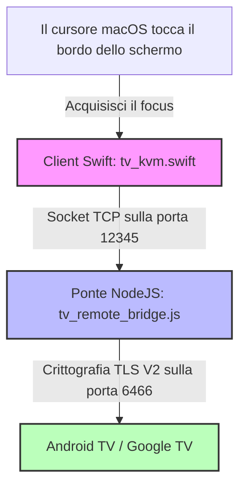

# Pano — Bridge KVM wireless da macOS ad Android TV

🌐 **[English](README.md) | [Русский](README.ru.md) | [Deutsch](README.de.md) | [Français](README.fr.md) | [Italiano](README.it.md) | [Español](README.es.md) | [中文](README.zh.md)**

<p align="center">
  
</p>

<p align="center">
  
  
  
  
  
</p>

---

**Pano** è un'applicazione premium ed estremamente leggera per la barra dei menu di macOS, abbinata a un bridge di loopback backend Node.js. Insieme, trasformano il trackpad e la tastiera del tuo Mac in uno switch KVM wireless e fluido per i tuoi dispositivi Google TV o Android TV.

A differenza delle normali app di controllo remoto per dispositivi mobili, Pano replica un'**esperienza KVM hardware nativa** sulla tua rete locale utilizzando il protocollo TLS crittografato ufficiale Google TV Remote V2. Offre uno scorrimento incredibilmente fluido, una navigazione reattiva con gesti sul trackpad, controllo istantaneo del volume di sistema della TV e una tastiera hardware completamente funzionale con carico CPU pari a zero.

---

## ⚡ Caratteristiche principali

### ⌨️ 1. Emulazione tastiera hardware (EN/RU)
* **Codici di scansione a basso livello**: Utilizza l'emulazione diretta dei codici di scansione di Android (es. `KEYCODE_A`, `KEYCODE_SPACE`) per la massima velocità di risposta e zero ritardi di input.
* **Supporto bilingue nativo**: Supporto completo per layout di tastiera inglesi e russi (inclusi maiuscole, minuscole, punteggiatura e simboli).
* **Compatibilità 100% con le app**: L'iniezione diretta aggira i fragili limiti di sincronizzazione del testo degli IME (Input Method Editor), funzionando perfettamente in tutte le app (YouTube, Netflix, browser, Yandex, Kinopoisk).
* **Fallback intelligente**: Passaggio automatico al protocollo IME nativo codificato in Base64 per caratteri speciali rari e altre lingue.

### 🖱️ 2. Gestione intelligente di trackpad e gesti
* **Navigazione discreta su griglia**: Traduce automaticamente i movimenti del mouse e gli scorrimenti del trackpad con un solo dito in clic direzionali D-pad precisi, che si adattano perfettamente all'interfaccia a tessere della Smart TV.
* **Controllo del volume tramite scorrimento**: Supporta il comodo scorrimento del trackpad a due dita per modificare il volume della TV (Più alto / Più basso) con un ritardo di ripetizione personalizzato e ultra-rapido di 60 ms.
* **Protezione dagli scorrimenti accidentali**: Durante lo scorrimento con due dita (regolazione del volume), Pano blocca temporaneamente la navigazione verticale D-pad per 300 ms, impedendo salti accidentali degli elenchi sulla TV.
* **Blocco del cursore**: Quando attivo, Pano acquisisce e blocca il cursore del mouse sul bordo dello schermo scelto, impedendogli di tornare accidentalmente nello spazio di lavoro macOS finché non si esce esplicitamente.

### 🖥️ 3. Transizione fluida tramite i bordi dello schermo
* **Attivazione senza clic**: Sposta il cursore del mouse sul bordo scelto del Mac (Destra, Sinistra o Sopra) e tienilo fermo per 800 ms. Pano acquisirà istantaneamente il focus e passerà il controllo alla TV. Il ritardo di 800 ms funge da filtro di sicurezza contro le attivazioni accidentali durante il lavoro quotidiano su Mac.
* **Elevazione del focus nativa**: L'applicazione Swift nativa eleva temporaneamente il livello della finestra a `.statusBar` e aggiorna la politica di attivazione di macOS per acquisire il focus in modo sicuro, per poi rilasciarlo in modo pulito all'uscita.

### 🔌 4. Carico CPU nullo e riconnessione automatica
* **Estremamente ottimizzato**: Presenta un processo di controllo dello stato (heartbeat) altamente ottimizzato che viene eseguito ogni 2 secondi con un carico CPU dello `0%`.
* **Ciclo di connessione robusto**: Risolve i blocchi dei socket della libreria sottostante `androidtv-remote`. La connessione viene garantita come chiusa e riavviata correttamente in caso di errori o disconnessioni.
* **Ripristino automatico**: Integra un timeout TLS di 5 secondi. Se la TV viene spenta o lascia la rete, Pano si disconnette in modo pulito e tenta il ripristino in background non appena il dispositivo è nuovamente raggiungibile.

### 🟢 5. Interfaccia della barra dei menu di macOS
* **Archiviazione sicura**: Salva in modo sicuro i certificats TLS e le chiavi di associazione dopo la prima volta, in modo che non sia richiesto un nuovo inserimento del PIN.
* **Avvio istantaneo**: Si connette automaticamente alla TV all'avvio dell'applicazione.
* **Indicatore di stato nativo**: Un'elegante icona di monitor monocromatica che si integra perfettamente con il tema del sistema macOS, indicando lo stato della connessione attraverso l'opacità e l'animazione:
  * **Connesso**: Icona del monitor completamente opaca con riempimento dello schermo.
  * **Connessione / Associazione**: Icona del monitor lampeggiante.
  * **Disconnesso / Non raggiungibile**: Icona del monitor parzialmente trasparente (35% di opacità).

---

## 🏗️ Architettura del progetto



* **`tv_kvm.swift`**: Un'applicazione Swift Cocoa nativa in esecuzione direttamente nella barra dei menu di macOS. Monitora i passaggi dai bordi dello schermo, fornisce una sovrapposizione touch trasparente, gestisce i gesti e invia comandi al socket di loopback.
* **`tv_remote_bridge.js`**: Un leggero helper Node.js che funge da server di loopback locale. Traduce i comandi in chiaro da Swift in messaggi Google TV Protobuf V2 crittografati e gestisce l'associazione TLS.
* **`lib_patches/`**: Patch preconfigurate che garantiscono prestazioni ottimali della libreria Node sottostante, risolvendo perdite di socket e aggiungendo un supporto completo per l'inserimento di testo tramite IME.

---

## 🛠️ Installazione e Configurazione

Scegli il metodo di installazione più adatto alle tue esigenze:

### Opzione 1: Installazione rapida tramite Homebrew Cask (Consigliato)
Se utilizzi Homebrew, puoi installare Pano con un singolo comando nel terminale:
```bash
brew install --cask ponano/pano/pano
```
Questo collegherà automaticamente il repository, scaricherà l'ultima versione e installerà `Pano.app` direttamente nella cartella Applicazioni.

### Opzione 2: Installazione manuale tramite immagine disco DMG
Se preferisci un programma di installazione grafico standard per macOS:
1. Apri la pagina dei [Rilasci di Pano (Releases)](https://github.com/ponano/androidtvremotemacos/releases) su GitHub.
2. Scarica l'ultimo file `Pano.dmg`.
3. Apri il file `.dmg` scaricato e trascina l'icona di **Pano** nella cartella **Applicazioni** (Applications).

### Opzione 3: Installazione dal codice sorgente (Per sviluppatori)
Se desideri compilare ed eseguire Pano manualmente:
1. **Prerequisiti**: Assicurati di avere **macOS 12.0+**, **Node.js (v16+)** e il **compilatore Swift** installato (incluso negli strumenti da riga di comando di Xcode).
2. **Clona o scarica** questo repository.
3. **Configura l'IP**: Apri il file `run_kvm.sh` in un editor di testo e inserisci l'indirizzo IP locale della tua TV:
   ```bash
   TV_IP="192.168.1.100"  # Sostituisci con l'IP della tua TV
   ```
4. **Esegui**: Avvia il bridge KVM tramite il Terminale:
   ```bash
   bash run_kvm.sh
   ```

---

### 🔑 Associazione Sicura (Solo al primo avvio)
Al primo avvio di Pano (indipendentemente dal metodo scelto):
1. Sullo schermo del Mac apparirà un popup sicuro che richiederà un codice PIN a 6 cifre.
2. Inserisci il PIN a 6 cifre visualizzato sullo schermo della tua Android TV / Google TV.
3. Una volta completato, i tuoi certificati TLS saranno salvati in modo sicuro in `~/.tv_kvm_credentials/` (o `~/.credentials/` in modalità test) e non sarà necessario ripetere l'associazione.
4. **Inizia a controllare**: Sposta il cursore verso il bordo scelto dello schermo del Mac, tienilo fermo per un istante (800 ms) e inizia a controllare la TV!

---

## 🔑 Mappatura dei tasti e dei gesti

Quando Pano è attivo, i tuoi input da tastiera vengono trasmessi alla TV come segue:

| Tasto Mac | Comando Android TV |
| :--- | :--- |
| **`Tasti freccia` (Su/Giù/Sinistra/Destra)** | Navigazione (D-pad Su/Giù/Sinistra/Destra) |
| **`Invio` / `Enter`** | Conferma / OK (D-pad Center) |
| **`Backspace` / `Canc` / `Esc`** | Pulsante Indietro |
| **`Cmd` + `Backspace`** o **`Cmd` + `Esc`** | Schermata principale (Home Screen) |
| **`Spazio`** | Riproduci / Pausa media |
| **`F11` / `F12`** (o **Tasti volume**) | Riduci / Aumenta il volume della TV |
| **`F10`** (or **Tasto Mute**) | Disattiva l'audio della TV |
| **`Tab`** | Elemento selezionabile successivo |
| **`Doppio Shift`** o **`Ctrl` + `Spazio`** | Cambia la lingua di input (EN ⇄ RU) |
| **Qualsiasi carattere (A-Z, 0-9, Simboli)** | Inserimento diretto di testo in qualsiasi campo di input |

### Gesti & Azioni del Trackpad
* **Scorrimento a un dito (Su / Giù / Sinistra / Destra)**: Si traduce in clic direzionali D-pad standard per navigare tra griglie e menu.
* **Scorrimento a due dita (Su / Giù)**: Controlla il volume della TV (Più alto / Più basso).

---

## 🛡️ Autorizzazione di Accessibilità macOS (Accessibility)

Poiché Pano traccia il cursore del mouse sul bordo dello schermo e reindirizza i codici di scansione della tastiera quando è attivo, **macOS richiede di concedere le autorizzazioni di Accessibilità al terminale o all'app compilata**.

### Come autorizzare l'applicazione:
1. Quando avvii `run_kvm.sh` per la prima volta, macOS mostrerà una finestra di dialogo di sistema che indica: *"Terminal (o tv_kvm) desidera controllare questo computer utilizzando le funzionalità di accessibilità"*.
2. Fai clic su **Apri Impostazioni di sistema**.
3. Passa a **Privacy e sicurezza** ➔ **Accessibilità**.
4. Cerca **Terminal** (o **tv_kvm**) nell'elenco e attiva l'interruttore (🟢).
5. Riavvia lo script `run_kvm.sh` nel terminale.

---

## 📄 Licenza

Questo progetto è open-source e distribuito sotto la [Licenza MIT](LICENSE).
