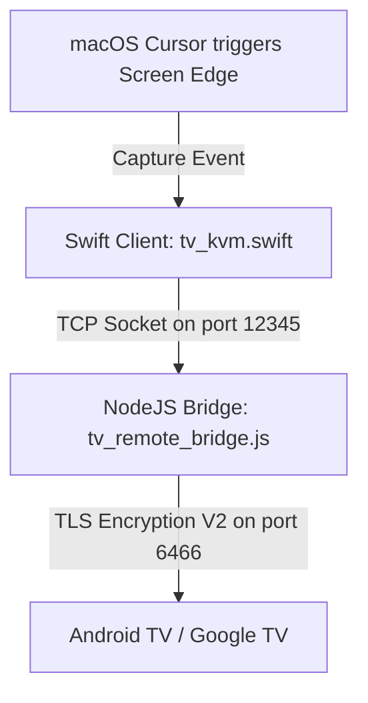
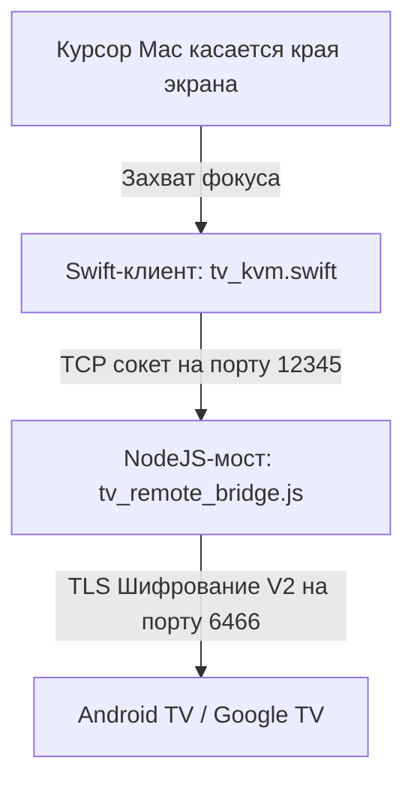

# macOS to Android TV Wireless KVM Bridge (Google TV Remote V2 Protocol)

[Русская версия описания находится ниже](#russian-version)

A premium, ultra-lightweight macOS menu bar application and Node.js backend bridge that turns your Mac's Trackpad and Keyboard into a seamless, wireless KVM switch for your Google TV / Android TV device. 

Unlike basic remote controls, this bridge replicates a **native hardware KVM experience** over the local network using Google TV Remote V2 encrypted TLS protocol, offering ultra-smooth scrolling, responsive swipes, volume controls, and a fully functional keyboard with zero CPU overhead.

---

## Key Features

1. **Hardware Keyboard Emulation (EN/RU)**
   * Uses low-level scan-code emulation (e.g., `KEYCODE_A`, `KEYCODE_SPACE`) for maximum speed and compatibility. 
   * Fully supports Russian and English keyboard layouts with uppercase, lowercase, and symbols.
   * Direct injection bypasses fragile IME text synchronization limits, working in 100% of apps (YouTube, browser, Yandex, Netflix).
   * Safe fallback to Base64-encoded native IME protocols for rare special characters.

2. **Ultra-Smooth Trackpad Capture (Discrete Swipe & Scroll)**
   * Custom gestures matching TV interface grids.
   * Multi-finger scrolling emulation with a soft 250ms repeat cooldown to avoid list overshooting.
   * Tracks natural inertia and blocks cursor escape while active, keeping it securely locked to the screen edge.

3. **Seamless Screen Edge Switching (Right, Left, Top)**
   * Move your mouse to the chosen edge of your Mac (Right, Left, or Top), wait 800ms (configured as a safety filter against accidental triggers), and your trackpad/keyboard are instantly captured by the TV.
   * Swift application temporarily elevates window level to `.statusBar` and updates activation policy to grab focus securely, then cleanly releases focus when exiting.

4. **Zero CPU Overhead & Smart Auto-Reconnect**
   * High-frequency heartbeat checker running every 2 seconds with `0% CPU` footprint.
   * Solved socket hanging bugs inside the `androidtv-remote` library: connection promise correctly rejects/resolves on close or error.
   * Embedded 5-second TLS connect timeout. If the TV is shut down, the client disconnects gracefully and begins re-connecting in the background.

5. **Menu Bar Status & Auto-Connect**
   * Safe storing of TLS certificate.
   * Automatically connects to the TV on launch if already paired.
   * Dynamic colored status icon (`🟢 Connected`, `🟡 Connecting / Enter PIN`, `🔴 Disconnected`).

---

## Project Architecture



* **`tv_kvm.swift`**: Native Swift Cocoa App running in the Mac Menu Bar. Tracks cursor edges, creates a transparent border window, handles swipes, scrolls, and maps keyboard presses to command strings.
* **`tv_remote_bridge.js`**: Lightweight Node.js server that acts as a local TCP loopback, translates text commands from Swift into Google TV Protobuf V2 messages, and handles TLS handshakes.
* **`lib_patches/`**: Pre-configured patches ensuring optimal library performance (fixing connection hangs, adding missing Protobuf structures forIME, etc.).

---

## Installation & Running

1. **Prerequisites**
   * macOS (MacBook, Mac Mini, iMac)
   * Node.js (v16+)
   * Swift Compiler (installed by default with macOS CLI Tools or Xcode)

2. **Quick Start**
   * Edit `run_kvm.sh` and set your TV's IP address:
     ```bash
     TV_IP="192.168.x.x"
     ```
   * Launch the KVM bridge in your terminal:
     ```bash
     bash run_kvm.sh
     ```
   * On your first run, a popup on your Mac will ask for the 6-digit PIN displayed on your TV screen. Type it in to complete secure TLS pairing.
   * Move your cursor to the edge of the screen to start controlling your TV!

---

<a name="russian-version"></a>

# Беспроводной KVM-мост macOS -> Android TV (Протокол Google TV Remote V2)

Премиальное ультралегкое приложение для строки меню macOS и Node.js бэкенд-мост, превращающие трекпад и клавиатуру вашего Mac в бесшовный, беспроводной KVM-переключатель для Google TV / Android TV.

В отличие от обычных пультов управления, этот проект воспроизводит **опыт работы с настоящим аппаратным KVM** по локальной сети через шифрованное TLS-подключение, обеспечивая невероятно плавный скроллинг, отзывчивую свайп-навигацию, регулировку громкости и полноценный набор текста без нагрузки на процессор (0% CPU).

---

## Ключевые возможности

1. **Эмуляция аппаратной клавиатуры (EN/RU)**
   * Использует низкоуровневую эмуляцию скан-кодов (например, `KEYCODE_A`, `KEYCODE_SPACE`) для максимальной скорости и 100% совместимости.
   * Полностью поддерживает русскую и английскую раскладки во всех регистрах и со всеми знаками препинания.
   * Прямая передача клавиш обходит ограничения хрупкой синхронизации полей ввода (IME), стабильно работая во всех приложениях (YouTube, Яндекс, Кинопоиск, браузер).
   * Автоматический фолбэк на Base64 IME протокол для редких спецсимволов.

2. **Сверхплавный захват трекпада (Дискретные жесты)**
   * Умный алгоритм переводит перемещение пальцев по тачпаду в дискретные команды D-pad.
   * Поддержка скроллинга двумя пальцами со встроенным кулдауном повтора (250 мс) для исключения инерционных «пролетов» списков на ТВ.
   * Надежная фиксация курсора на краю экрана во время активности для предотвращения его вылета на Mac.

3. **Мгновенный переход через края экрана (Справа, Слева, Сверху)**
   * Просто переведите мышь к выбранному краю вашего Mac, подождите 800 мс (защита от случайных переходов при работе), и управление мгновенно захватится телевизором.
   * Swift-приложение автоматически повышает приоритет своего окна до `.statusBar` и активирует фокус ввода, а при выходе полностью возвращает фокус предыдущей программе.

4. **Отсутствие нагрузки на процессор (0% CPU) и Умное автоподключение**
   * Легковесный Heartbeat-процесс проверяет сокет каждые 2 секунды с абсолютно нулевой нагрузкой.
   * Успешно решена проблема зависания библиотеки `androidtv-remote`: промис подключения теперь гарантированно возвращает ошибку при обрыве сокета.
   * Интегрирован 5-секундный тайм-аут TLS-подключения. Если ТВ выключен, мост мгновенно уходит в оффлайн и плавно перезапускает цикл переподключения.

5. **Меню-бар статус и Авто-запуск**
   * Безопасное хранение сертификатов TLS.
   * Автоматическое мгновенное подключение к ТВ при старте приложения (без лишних кликов).
   * Динамическое цветовое отображение статуса (`🟢 Подключен`, `🟡 Подключение / Введите PIN`, `🔴 Отключен`).

---

## Архитектура проекта



* **`tv_kvm.swift`**: Нативное Cocoa-приложение, работающее в macOS Menu Bar. Отслеживает выход курсора за границы, создает прозрачное триггерное окно, захватывает жесты тачпада и транслирует клавиши клавиатуры в текстовые команды для сокета.
* **`tv_remote_bridge.js`**: Легковесный сервер на Node.js, играющий роль локального TCP-петли (loopback). Принимает команды от Swift по TCP и транслирует их в зашифрованные Protobuf-пакеты для Google TV.
* **`lib_patches/`**: Патчи для оптимизации сторонней библиотеки (устранение зависаний, поддержка расширенных структур Protobuf для набора текста).

---

## Установка и запуск

1. **Требования**
   * macOS (MacBook, Mac Mini, iMac)
   * Node.js (v16+)
   * Компилятор Swift (устанавливается по умолчанию вместе с macOS CLI Tools или Xcode)

2. **Быстрый старт**
   * Откройте файл `run_kvm.sh` и укажите IP-адрес вашего телевизора:
     ```bash
     TV_IP="192.168.x.x"
     ```
   * Запустите KVM-мост через терминал:
     ```bash
     bash run_kvm.sh
     ```
   * При первом запуске на Mac появится окно для ввода PIN-кода. Введите 6-значный код, отобразившийся на экране вашего телевизора.
   * Просто ведите курсор к краю экрана, чтобы начать управлять ТВ!
