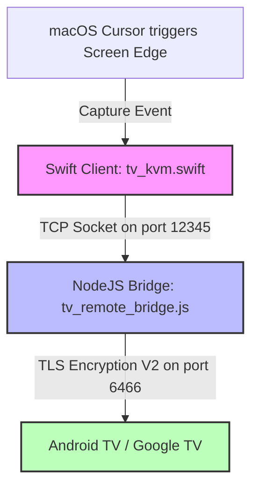

# Pano — macOS to Android TV Wireless KVM Bridge

🌐 **[English](README.md) | [Русский](README.ru.md) | [Deutsch](README.de.md) | [Français](README.fr.md) | [Italiano](README.it.md) | [Español](README.es.md) | [中文](README.zh.md)**

<p align="center">
  
</p>

<p align="center">
  
  
  
  
  
</p>

---

**Pano** is a premium, ultra-lightweight macOS menu bar application and Node.js loopback backend bridge that turns your Mac's Trackpad and Keyboard into a seamless, wireless KVM switch for your Google TV or Android TV device.

Unlike basic mobile remote apps, Pano replicates a **native hardware KVM experience** over your local network using the official Google TV Remote V2 encrypted TLS protocol. It offers ultra-smooth scrolling, responsive trackpad gesture navigation, instant system volume controls, and a fully functional hardware keyboard layout with zero CPU overhead.

---

## ⚡ Key Features

### ⌨️ 1. Hardware Keyboard Emulation (EN/RU)
* **Low-Level Scan-Codes**: Uses direct Android scan-code emulation (e.g., `KEYCODE_A`, `KEYCODE_SPACE`) for maximum speed and zero input lag.
* **Bilingual Out of the Box**: Full native support for English and Russian keyboard layouts (including uppercase, lowercase, punctuation, and symbols).
* **100% App Compatibility**: Direct injection bypasses fragile IME (Input Method Editor) text synchronization limits, working flawlessly in every app (YouTube, Netflix, browsers, Yandex, Kinopoisk).
* **Smart Fallback**: Safe fallback to Base64-encoded native IME protocols for rare special characters.

### 🖱️ 2. Intelligent Trackpad & Gestures
* **Discrete Grid Navigation**: Automatically translates mouse movements and single-finger trackpad swipes into crisp, tactile D-pad directional clicks matching the TV layout.
* **Volume Scroll Control**: Supports convenient two-finger trackpad scrolling to change the TV volume (Volume Up / Down) with a custom, ultra-fast 60ms repeat cooldown.
* **Accidental Swipe Protection**: While you are scrolling with two fingers (adjusting volume), Pano temporarily blocks vertical D-pad navigation for 300ms, preventing accidental list jumps on your TV.
* **Cursor Lock & Protection**: When active, Pano captures and locks your mouse cursor to the chosen screen edge, preventing it from escaping back to your macOS workspace until you explicitly exit.

### 🖥️ 3. Seamless Screen Edge Switching
* **Zero-Click Activation**: Move your mouse cursor to the chosen edge of your Mac (Right, Left, or Top) and pause for 800ms. Pano will instantly grab focus and hand control to your TV. The 800ms safety filter protects against accidental triggers during daily Mac use.
* **Native Focus Elevation**: The native Swift application temporarily raises its window level to `.statusBar` and updates the macOS activation policy to grab focus securely, then cleanly releases it when you exit.

### 🔌 4. Zero CPU Overhead & Auto-Reconnect
* **Ultra-Lightweight**: Features a highly optimized heartbeat checker running every 2 seconds with `0% CPU` footprint.
* **Robust Connection Lifecycle**: Solves socket hanging bugs inside the `androidtv-remote` library. The connection correctly resolves or rejects on close or error.
* **TLS Fail-safe**: Integrates a 5-second TLS connection timeout. If the TV is turned off or leaves the network, Pano disconnects gracefully and begins re-connecting in the background.

### 🟢 5. macOS Menu Bar Interface
* **Secure Storage**: Safely saves TLS certificates and keys so pairing is only required once.
* **Instant Auto-Connect**: Automatically connects to the TV on launch if already paired.
* **Native Status Indicator**: A sleek, monochrome monitor icon that integrates with the macOS system theme, showing connection states through opacity and animation:
  * **Connected**: Fully opaque monitor icon with screen fill.
  * **Connecting / Pairing**: Animating blinking monitor icon.
  * **Disconnected / Unreachable**: Semi-transparent monitor icon (35% opacity).

---

## 🏗️ Project Architecture



* **`tv_kvm.swift`**: A native Swift Cocoa application running directly in the macOS Menu Bar. It monitors screen edge transitions, hosts a transparent touch-capturing overlay, handles gesture processing, and sends raw commands to the loopback socket.
* **`tv_remote_bridge.js`**: A lightweight Node.js helper that acts as a local loopback server. It translates the plain-text commands sent from Swift into encrypted Google TV Protobuf V2 messages and handles TLS pairing.
* **`lib_patches/`**: Pre-configured patches ensuring optimal performance of the underlying Node library, resolving socket leaks and adding comprehensive IME text input support.

---

## 🛠️ Installation & Setup

Choose the installation method that fits you best:

### Option 1: Fast Installation via Homebrew Cask (Recommended)
If you use Homebrew, you can install Pano in a single terminal command:
```bash
brew install --cask ponano/pano/pano
```
This automatically taps the repository, downloads the latest release, and installs `Pano.app` into your Applications folder.

### Option 2: Manual Installation via DMG Disk Image
If you prefer a standard macOS installation:
1. Open the [Pano Releases](https://github.com/ponano/androidtvremotemacos/releases) page on GitHub.
2. Download the latest `Pano.dmg` file.
3. Open the downloaded `.dmg` file and drag the **Pano** icon into your **Applications** folder.

### Option 3: Developer / Source Code Installation
If you want to build and run Pano from source:
1. **Prerequisites**: Ensure you have **macOS 12.0+**, **Node.js (v16+)**, and the **Swift Compiler** installed (comes with Xcode Command Line Tools).
2. **Clone or Download** this repository.
3. **Configure IP**: Open the file `run_kvm.sh` in a text editor and set your TV's local IP address:
   ```bash
   TV_IP="192.168.1.100"  # Replace with your TV's IP address
   ```
4. **Run**: Launch the KVM bridge using your Terminal:
   ```bash
   bash run_kvm.sh
   ```

---

### 🔑 Secure Pairing (First Launch Only)
On the first launch of Pano (using any method above):
1. A secure popup will appear on your Mac screen asking for a 6-digit PIN.
2. Type in the 6-digit PIN displayed on your Android TV / Google TV screen.
3. Once completed, your TLS certificates are saved securely in `~/.tv_kvm_credentials/` (or `~/.credentials/` in test mode) and you won't need to pair again.
4. **Start Controlling**: Move your cursor to the selected edge of your Mac screen, pause for a moment (800ms), and start navigating your TV!

---

## 🔑 Keyboard & Gesture Mappings

While Pano is active, your Mac inputs are mapped to Android TV commands as follows:

| Mac Keyboard Input | Android TV Command |
| :--- | :--- |
| **`Arrow Keys` (Up/Down/Left/Right)** | Navigation (D-pad Up/Down/Left/Right) |
| **`Return` / `Enter`** | Select / OK (D-pad Center) |
| **`Backspace` / `Delete` / `Escape`** | Back Button |
| **`Cmd` + `Backspace`** or **`Cmd` + `Escape`** | Home Screen |
| **`Space`** | Play / Pause Media |
| **`F11` / `F12`** (or **Volume keys**) | TV Volume Down / Up |
| **`F10`** (or **Mute key**) | TV Mute |
| **`Tab`** | Next Focusable Item |
| **`Double Shift`** or **`Ctrl` + `Space`** | Switch Input Layout (EN ⇄ RU) |
| **Any Character (A-Z, А-Я, 0-9, Symbols)** | Type text directly into any input field |

### Trackpad Gestures & Actions
* **Single-finger Swipe (Up / Down / Left / Right)**: Translates into standard D-pad directional clicks for navigating grids and menus.
* **Two-finger Scroll (Up / Down)**: Controls the TV Volume (Volume Up / Down).

---

## 🛡️ macOS Accessibility Permission

Because Pano tracks your mouse pointer on the edge of the screen and redirects keyboard scan-codes when active, **macOS requires you to grant Accessibility permissions** to the terminal or compiled app.

### How to authorize:
1. When you run `run_kvm.sh` for the first time, macOS will show a system dialog stating: *"Terminal (or tv_kvm) would like to control this computer using accessibility features"*.
2. Click **Open System Settings**.
3. Go to **Privacy & Security** ➔ **Accessibility**.
4. Find **Terminal** (or **tv_kvm**) in the list and toggle the switch to **ON** (🟢).
5. Restart `run_kvm.sh` in the terminal.

---

## 📄 License

This project is open-source and available under the [MIT License](LICENSE).
