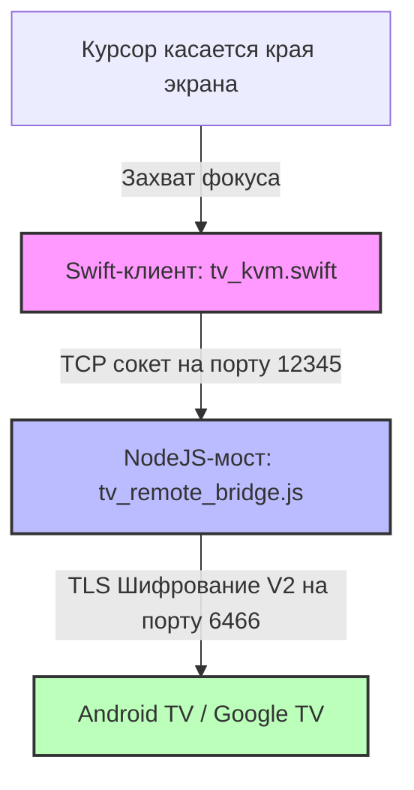

# Pano — Беспроводной KVM-мост macOS ⇄ Android TV

🌐 **[English](README.md) | [Русский](README.ru.md) | [Deutsch](README.de.md) | [Français](README.fr.md) | [Italiano](README.it.md) | [Español](README.es.md) | [中文](README.zh.md)**

<p align="center">
  
</p>

<p align="center">
  
  
  
  
  
</p>

---

**Pano** — это премиальное ультралегковесное приложение для строки меню macOS и Node.js бэкенд-мост, превращающие трекпад и клавиатуру вашего Mac в бесшовный, беспроводной KVM-переключатель для телевизоров под управлением Google TV и Android TV.

В отличие от простых мобильных приложений-пультов, Pano воссоздает **опыт работы с настоящим аппаратным KVM** по локальной сети через официальный шифрованный протокол TLS Google TV Remote V2. Проект обеспечивает невероятно плавный скроллинг, отзывчивое управление жестами трекпада, регулировку системной громкости телевизора и полноценный ввод текста с аппаратной клавиатуры Mac с абсолютно нулевой нагрузкой на процессор.

---

## ⚡ Ключевые возможности

### ⌨️ 1. Эмуляция аппаратной клавиатуры (EN/RU)
* **Низкоуровневые скан-коды**: Использует прямую эмуляцию скан-кодов Android (например, `KEYCODE_A`, `KEYCODE_SPACE`) для максимальной скорости отклика и полного отсутствия задержек.
* **Двуязычный ввод**: Нативная поддержка русской и английской раскладок клавиатуры Mac (включая верхний/нижний регистр, знаки препинания и спецсимволы).
* **100% Совместимость с приложениями**: Прямой ввод обходит ограничения хрупкой синхронизации полей ввода (IME), стабильно работая в абсолютно любых приложениях (YouTube, Кинопоиск, Яндекс, браузеры, Netflix).
* **Умный фолбэк**: Автоматическое переключение на Base64-кодированный протокол IME для редких специальных символов.

### 🖱️ 2. Интеллектуальный трекпад и жесты
* **Дискретная навигация**: Автоматически переводит движения мыши и свайпы одним пальцем по трекпаду в четкие дискретные сигналы D-pad (стрелки) на ТВ.
* **Управление громкостью скроллом**: Поддерживает удобное изменение громкости телевизора (громче / тише) с помощью прокрутки двумя пальцами по тачпаду со сверхбыстрым кулдауном 60 мс.
* **Защита от случайных перескоков**: Во время скроллинга двумя пальцами (регулировки громкости) Pano временно блокирует вертикальные D-pad свайпы на 300 мс, чтобы фокус на ТВ случайно не перескакивал по меню.
* **Блокировка курсора**: Во время управления телевизором курсор мыши надежно привязывается к выбранному краю экрана Mac, предотвращая его случайный вылет на рабочий стол компьютера.

### 🖥️ 3. Бесшовный переход по краям экрана
* **Активация без кликов**: Просто подведите курсор к выбранному краю экрана вашего Mac (Справа, Слева или Сверху) и задержите его на 800 мс. Pano мгновенно перехватит фокус ввода и передаст управление на ТВ. Задержка в 800 мс служит фильтром от ложных срабатываний при повседневной работе.
* **Повышенный приоритет фокуса**: Нативное Swift-приложение автоматически поднимает уровень своего окна до `.statusBar` и обновляет политику активации macOS для безопасного захвата ввода, а при выходе полностью возвращает фокус предыдущей программе.

### 🔌 4. Отсутствие нагрузки на процессор и автоподключение
* **Максимальная оптимизация**: Легковесный процесс проверки статуса (heartbeat) запускается каждые 2 секунды с абсолютно `0% CPU` нагрузкой.
* **Отказоустойчивый сокет**: Успешно решены проблемы зависания сокетов оригинальной библиотеки `androidtv-remote`. Подключение гарантированно закрывается и перезапускается в случае ошибок или обрыва связи.
* **Автоматическое восстановление**: Интегрирован 5-секундный тайм-аут TLS. Если телевизор выключается или уходит в спящий режим, Pano корректно отключается и в фоновом режиме ожидает его пробуждения для автоподключения.

### 🟢 5. Строка меню macOS (Menu Bar)
* **Безопасное хранение ключей**: TLS-сертификаты и ключи сопряжения надежно сохраняются при первом подключении. Повторный ввод PIN-кода не требуется.
* **Мгновенный старт**: Автоматическое подключение к ТВ при запуске приложения.
* **Нативный статус-индикатор**: Элегантная монохромная иконка монитора адаптируется под светлую или темную тему оформления macOS, меняя свое состояние:
  * **Подключен**: полностью непрозрачная иконка монитора с заливкой экрана.
  * **Подключение / Ввод PIN**: мигающая в меню-баре иконка.
  * **Отключен / Недоступен**: полупрозрачная иконка монитора (35% непрозрачности).

---

## 🏗️ Архитектура проекта



* **`tv_kvm.swift`**: Нативное Cocoa-приложение на Swift, работающее в macOS Menu Bar. Отслеживает выход курсора за границы, создает прозрачное триггерное окно, захватывает жесты тачпада и транслирует клавиши клавиатуры в команды для сокета.
* **`tv_remote_bridge.js`**: Легковесный сервер на Node.js, играющий роль локальной петли (loopback). Принимает текстовые команды от Swift по TCP и транслирует их в зашифрованные Protobuf-пакеты для Google TV.
* **`lib_patches/`**: Патчи для оптимизации сторонней библиотеки (устранение зависаний, поддержка расширенных структур Protobuf для набора текста).

---

## 🛠️ Установка и быстрый старт

### 1. Требования
* **macOS** 12.0+ (Monterey, Ventura, Sonoma, Sequoia)
* **Node.js** (версия 16 или выше)
* **Компилятор Swift** (устанавливается автоматически с macOS Command Line Tools или Xcode)

### 2. Быстрый запуск
1. **Скачайте или клонируйте** проект в рабочую папку.
2. **Откройте файл `run_kvm.sh`** в текстовом редакторе и укажите локальный IP-адрес вашего телевизора:
   ```bash
   TV_IP="192.168.1.100"  # Укажите IP вашего Android TV / Google TV
   ```
3. **Запустите KVM-мост** через Терминал macOS:
   ```bash
   bash run_kvm.sh
   ```
4. **Выполните сопряжение**: 
   При первом запуске на экране Mac появится всплывающее окно для ввода PIN-кода. Введите 6-значный код, который отобразится на экране вашего телевизора, чтобы завершить безопасное TLS-подключение.
5. **Пользуйтесь!** Подведите курсор к выбранному краю экрана Mac, задержите его на мгновение и управляйте ТВ с клавиатуры и трекпада.

---

## 🔑 Сопоставление клавиш и жестов

Когда управление перехвачено Pano, ввод с Mac транслируется на Android TV следующим образом:

| Ввод на Mac | Команда на Android TV |
| :--- | :--- |
| **`Клавиши со стрелками` (Вверх/Вниз/Влево/Вправо)** | Навигация (D-pad Вверх/Вниз/Влево/Вправо) |
| **`Return` / `Enter`** | Подтверждение / Выбор (D-pad Center) |
| **`Backspace` / `Delete` / `Escape`** | Кнопка «Назад» (Back) |
| **`Cmd` + `Backspace`** или **`Cmd` + `Escape`** | Домашний экран (Home Screen) |
| **`Пробел`** | Воспроизведение / Пауза медиа |
| **`F11` / `F12`** (или **Клавиши громкости**) | Убавить / Добавить громкость ТВ |
| **`F10`** (или **Клавиша Mute**) | Отключить звук ТВ |
| **`Tab`** | Следующий элемент в фокусе |
| **`Двойной Shift`** или **`Ctrl` + `Пробел`** | Сменить язык ввода (EN ⇄ RU) |
| **Любые буквы (A-Z, А-Я, 0-9, Символы)** | Прямой набор текста в любое активное поле ввода |

### Жесты трекпада и действия
* **Свайп одним пальцем (Вверх / Вниз / Влево / Вправо)**: Транслируется в стандартные нажатия D-pad для перемещения по плиткам и спискам.
* **Скролл двумя пальцами (Вверх / Вниз)**: Управление громкостью телевизора (Громче / Тише).

---

## 🛡️ Разрешения универсального доступа (Accessibility) macOS

Так как Pano отслеживает положение мыши у края экрана и перехватывает скан-коды клавиатуры в активном режиме, **macOS требует выдать права универсального доступа** терминалу или скомпилированному приложению.

### Инструкция по настройке:
1. При первом запуске скрипта `run_kvm.sh` macOS покажет диалоговое окно: *"Программа Терминал (или tv_kvm) запрашивает доступ к управлению этим компьютером с помощью функций универсального доступа"*.
2. Нажмите кнопку **Открыть Системные настройки**.
3. Перейдите в раздел **Конфиденциальность и безопасность** ➔ **Универсальный доступ**.
4. Найдите **Терминал** (или **tv_kvm**) в списке приложений и переключите тумблер в активное положение (🟢).
5. Запустите скрипт `run_kvm.sh` повторно в терминале.

---

## 📄 Лицензия

Этот проект является открытым и распространяется по лицензии [MIT License](LICENSE).
