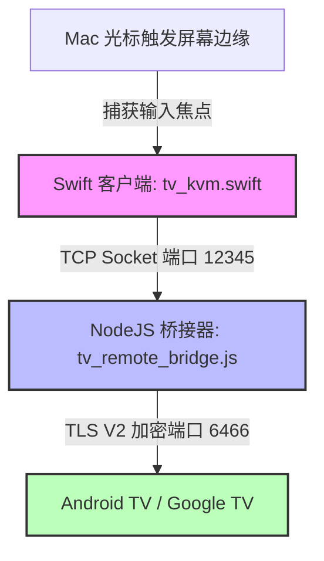

# Pano — macOS 至 Android TV 无线 KVM 桥接器

🌐 **[English](README.md) | [Русский](README.ru.md) | [Deutsch](README.de.md) | [Français](README.fr.md) | [Italiano](README.it.md) | [Español](README.es.md) | [中文](README.zh.md)**

<p align="center">
  
</p>

<p align="center">
  
  
  
  
  
</p>

---

**Pano** 是一款专为 macOS 设计的极简、轻量级菜单栏应用，并配备了 Node.js 本地环回后端桥接器。它能将您 Mac 的触控板和键盘无缝转化为无线 KVM 切换器，直接操控您的 Google TV 或 Android TV 设备。

与普通的移动端虚拟遥控器不同，Pano 通过局域网利用 Google 官方加密的 TLS 协议 (Google TV Remote V2) 实现**原生硬件级 KVM 体验**。它提供极度平滑的滚动、灵敏的触控板手势导航、瞬时电视系统音量调节，以及完整的物理键盘打字输入支持，且系统 CPU 占用率始终保持在 0%。

---

## ⚡ 核心功能

### ⌨️ 1. 原生硬件键盘模拟 (EN/RU)
* **低级扫描码 (Scan-Codes)**: 使用直接的 Android 扫描码模拟（如 `KEYCODE_A`，`KEYCODE_SPACE`）以确保极速响应和零输入延迟。
* **物理双语输入**: 原生完整支持英文和俄文键盘布局（包括大写、小写、标点符号和特殊符号）。
* **100% 应用兼容性**: 键值直接注入绕过了极其脆弱的输入法 (IME) 文本同步限制，在所有电视端应用（YouTube, Netflix, 浏览器, Yandex, 极光TV 等）中均能完美工作。
* **智能回退 (Fallback)**: 遇到罕见的特殊字符及其他非英/俄语输入时，系统会自动无缝回退到基于 Base64 编码的官方原生 IME 协议进行输入。

### 🖱️ 2. 智能触控板与手势操作
* **离散网格导航**: 自动将单指在触控板上的轻扫和滑动转化为精细的方向键 (D-pad) 离散点击，完美适配智能电视的网格磁贴式界面。
* **双指滚动调节音量**: 支持使用极具实用性的双指在触控板上滚动，直接调整电视系统音量（增加 / 降低），配备 60ms 的超快重复冷却时间。
* **防误触手势保护**: 当您使用双指滚动（调节音量）时，Pano 会在 300ms 内临时拦截垂直 D-pad 方向轻扫，防止电视端列表发生意外的菜单跳转。
* **光标安全锁定**: 当 KVM 激活时，Pano 会把 Mac 的鼠标光标锁定在选定的屏幕边缘，防止光标意外滑回 macOS 桌面，直至您明确按下退出键。

### 🖥️ 3. 无缝屏幕边缘热切换
* **零点击唤醒**: 仅需将 Mac 的鼠标光标移到所选的屏幕边缘（右侧、左侧或顶部）并停留 800 毫秒，Pano 就会瞬间捕获输入焦点，将键盘和触控板交给电视控制。800ms 的安全过滤器能完美避免日常在 Mac 上工作时的误触切换。
* **原生窗口层级提升**: Swift 原生客户端会自动将触发窗口的层级临时提升至 `.statusBar` 并更新 macOS 激活策略以安全获取输入，在您退出时会干净利落地将焦点归还给原程序。

### 🔌 4. 0% CPU 占用与自动重连
* **极度轻量化**: 采用高度优化的连接探活机制 (Heartbeat)，每 2 秒运行一次，CPU 占用率始终为 `0%`。
* **健壮的连接周期**: 彻底修复了底层 `androidtv-remote` 库的套接字悬挂 (hanging) Bug，确保在发生网络断开或报错时套接字能被干净地关闭并自动重新初始化。
* **TLS 安全重连**: 集成了 5 秒 TLS 连接超时机制。如果电视关机或离开局域网，Pano 会优雅退网，并在后台默默等待电视重新唤醒后自动恢复连接。

### 5. macOS 原生菜单栏界面
* **安全本地存储**: 在首次配对成功后，将 TLS 证书和密钥加密存储于本地，后续启动无需再次输入配对 PIN 码。
* **启动即连接**: 启动应用时自动在后台静默连接已配对的电视。
* **原生状态指示器**: 采用精致的单色 (monochrome) 电视监视器图标，与 macOS 系统主题融 shadow 完美贴合，通过不透明度和动画展示不同的状态：
  * **已连接**: 完全不透明的监视器图标，且带有屏幕填充效果。
  * **正在连接 / 配对**: 监视器图标在菜单栏呈呼吸式闪烁 (blinking)。
  * **已断开 / 无法访问**: 呈半透明状态的监视器图标（35% 不透明度）。

---

## 🏗️ 项目架构



* **`tv_kvm.swift`**: 运行于 macOS 菜单栏的原生 Swift Cocoa 应用程序。负责监听屏幕边缘触发、托管透明的触控层、处理手势事件，并向本地环回套接字发送底层指令。
* **`tv_remote_bridge.js`**: 轻量级 Node.js 助手，充当本地 TCP 环回服务器。它将 Swift 发送的明文指令翻译为经过加密的 Google TV Protobuf V2 数据包，并管理 TLS 安全配对。
* **`lib_patches/`**: 预配置的补丁包，确保底层 Node 库的最佳性能，消除套接字泄漏，并增加对 IME 文本输入状态的完整支持。

---

## 🛠️ 安装与快速开始

### 1. 前提条件
* **macOS** 12.0+ (Monterey, Ventura, Sonoma, Sequoia)
* **Node.js** (v16 或更高版本)
* **Swift 编译器** (macOS Command Line Tools 或 Xcode 启动时会自动默认安装)

### 2. 快速设置步骤
1. **下载或克隆 (Clone)** 本项目到您的本地工作目录。
2. **用文本编辑器打开 `run_kvm.sh`**，填写您电视的局域网 IP 地址：
   ```bash
   TV_IP="192.168.1.100"  # 替换为您的 Android TV IP 地址
   ```
3. **在 macOS 终端中启动桥接器**:
   ```bash
   bash run_kvm.sh
   ```
4. **完成安全配对**: 
   首次启动时，Mac 屏幕上会出现一个安全的密码输入框。输入电视屏幕上显示的 6 位 PIN 码，即可完成安全的 TLS 证书交换和配对。
5. **开始体验**: 将鼠标移向所选的 Mac 屏幕边缘，停留片刻，即可开始流畅操控电视！

---

## 🔑 键盘按键与手势映射矩阵

当 Pano 激活时，您的 Mac 输入会被转换并传输至电视，映射关系如下：

| Mac 键盘输入 | Android TV 命令 |
| :--- | :--- |
| **`方向键` (上/下/左/右)** | 导航 (D-pad 上/下/左/右) |
| **`回车键` / `Enter`** | 确认 / OK (D-pad Center) |
| **`退格键` / `Delete` / `Esc`** | “返回”键 (Back) |
| **`Cmd` + `退格键`** 或 **`Cmd` + `Esc`** | “主页”键 (Home Screen) |
| **`空格键`** | 播放 / 暂停媒体 |
| **`F11` / `F12`** (或 **物理音量键**) | 降低 / 升高电视音量 |
| **`F10`** (或 **物理静音键**) | 电视静音 |
| **`Tab`** | 移动到下一个可聚焦元素 |
| **`双击 Shift`** 或 **`Ctrl` + `空格`** | 切换键盘输入布局 (EN ⇄ RU) |
| **任意字母/数字/符号 (A-Z, 0-9, 符号)** | 直接向当前电视端的任意输入框键入文本 |

### 触控板手势与动作
* **单指轻扫 (上 / 下 / 左 / 右)**: 转换为标准的 D-pad 方向点击，用于在网格和菜单中进行导航。
* **双指滚动 (上 / 下)**: 直接调整电视音量（增加 / 降低）。

---

## 🛡️ macOS 辅助功能授权 (Accessibility)

由于 Pano 需要在屏幕边缘捕获鼠标光标，并在激活状态下重定向键盘扫描码，**macOS 要求您必须为终端或编译后的应用授予“辅助功能”权限**。

### 如何授权：
1. 首次运行 `run_kvm.sh` 时，macOS 会弹出系统提示：*“‘终端’（或 tv_kvm）想使用辅助功能控制此电脑”*。
2. 点击 **打开系统设置**。
3. 进入 **隐私与安全性** ➔ **辅助功能**。
4. 在列表中找到 **终端 (Terminal)**（或 **tv_kvm**），将旁边的开关切至 **开启 (ON)** (🟢)。
5. 返回终端中重新运行 `run_kvm.sh` 脚本。

---

## 📄 开源协议

本项目开源，且在 [MIT License](LICENSE) 协议下可用。
